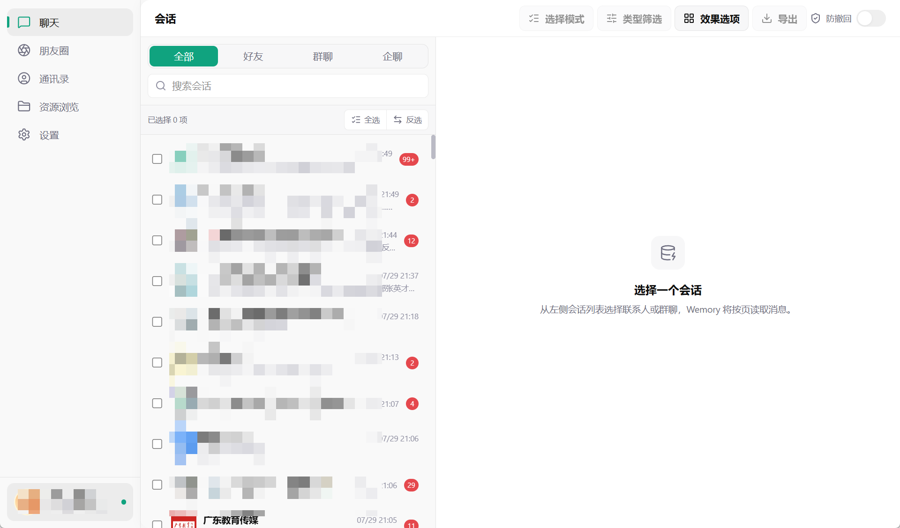
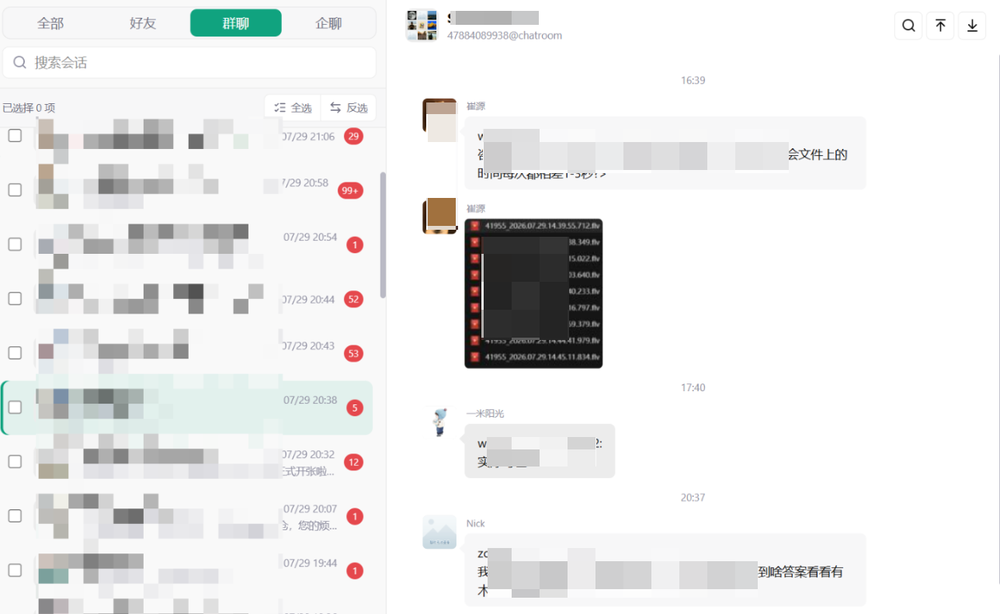
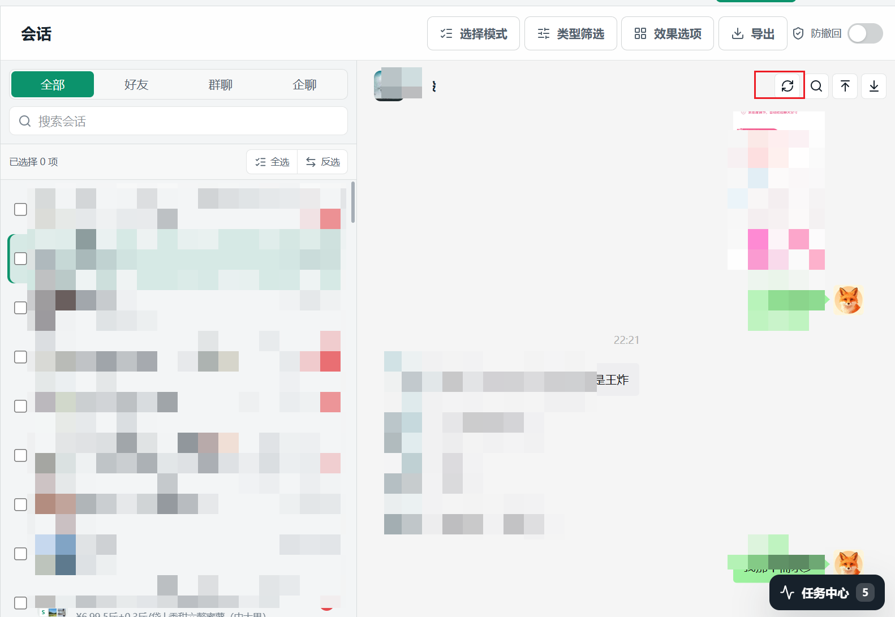
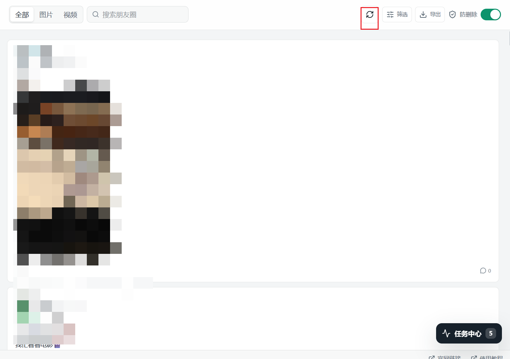
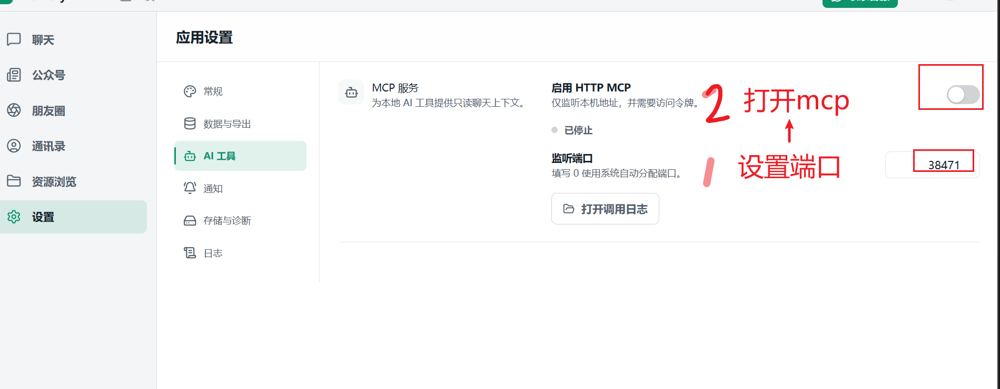
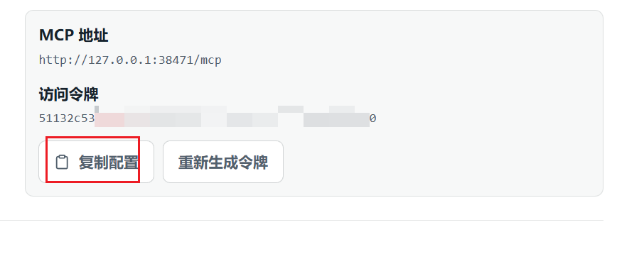
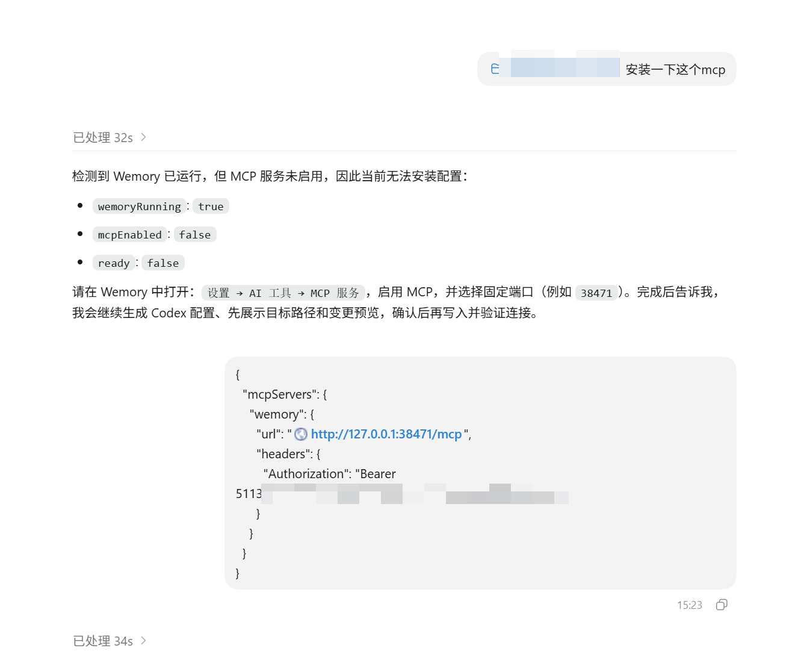
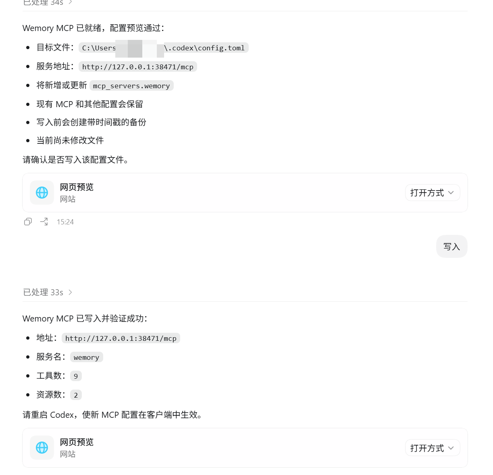
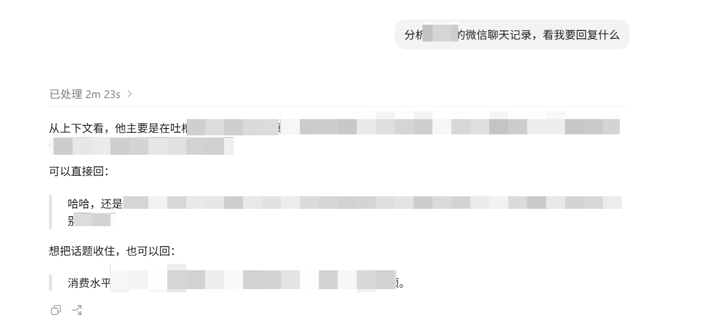
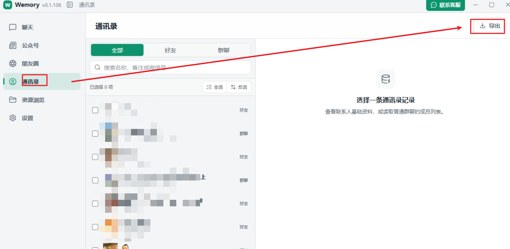

  
  <h1>Wemory</h1>
  
本地读取、浏览、备份与导出微信数据的 Windows 桌面工具

  

    <a href="https://wemory.bytefuse.cn/">产品官网</a> ·
    <a href="https://wemory.bytefuse.cn">下载最新版</a> ·
  

## Wemory 能做什么

Wemory 面向希望在自己的电脑上整理微信资料的用户。应用在本机读取和处理微信数据，帮助你集中浏览并按需导出：

- 聊天记录：浏览私聊、群聊和企业会话，导出为 HTML 或 PDF。
- 朋友圈：按时间浏览朋友圈内容，导出为 HTML 或 PDF。
- 通讯录：查看联系人，并将联系人和群成员导出为 XLSX。
- 公众号：批量采集、整理并导出公众号文章。
- AI 分析：通过本地 MCP 服务，让支持 MCP 的 AI 工具读取并分析聊天上下文。

## 本地优先

微信数据的读取、解密和导出均在本机完成，内容不会上传。联网仅用于应用更新及下载必要组件；导出文件由你自行选择保存位置。

## 聊天记录导出

Wemory 会将微信会话按好友、群聊和企业会话分类，支持搜索、类型筛选和批量选择。你可以在导出前直接浏览消息内容，并按日期范围导出指定会话。

聊天记录支持文本、图片、视频、语音、表情、附件和折叠消息等常见类型。图片使用原图导出，未下载的视频也会显示封面，便于离线查看和归档

## 资源刷新

在微信中打开尚未加载的图片或语音后，无需重启 Wemory。在聊天记录或朋友圈页面点击刷新按钮，即可重新读取已经下载到本机的资源。

## 使用 AI 分析聊天记录（MCP）

Wemory 可以在本机启动只读 HTTP MCP 服务，让 Codex、WorkBuddy 等支持 MCP 的 AI 工具按需读取当前连接账号的聊天上下文，用于摘要、检索和分析。服务仅监听本机地址，并使用访问令牌验证请求。

1. 打开“设置 > AI 工具”，设置固定端口并启用 HTTP MCP。

2. 服务启动后点击“复制配置”。请勿公开配置中的访问令牌。

3. 让 AI 工具按照[ https://github.com/yipeng641/WechatExporter/wemory-mcp-setup/SKILL.md](https://github.com/yipeng641/WechatExporter/blob/main/wemory-mcp-setup/SKILL.md) 完成安装。

4. 重启 AI 工具后，即可让它查找并分析指定会话的聊天记录。

## 公众号采集和导出

## 通讯录的导出

效果如下： 标签，群昵称，好友资料（手机号）都 有
 

## 下载与安装

1. 前往 [Releases](https://wemory.bytefuse.cn/) 下载
2. 在 Windows 10 或 Windows 11 x64 上运行安装程序。
3. 启动 Wemory，按照界面提示连接本机微信数据目录。

当前安装包尚未使用 Windows 代码签名证书签名，因此系统可能显示 Microsoft Defender SmartScreen 提示。

## 更新记录
### 2026.8.22

1. 群联系人导出，增加朋友资料(电话号) 支持多个手机号

### 2026.8.21

1. 公众号增加采集：阅读量，评论数，点赞数的采集
   
### 2026.8.19:

1. 本地的聊天数据和通讯录数据可以归档
2. 归档支持增量归档
3. 增加归档查看工具，可以查看你的归档
   在做

### 2026.8.14

1. 增加 MCP 功能，可以通过 AI 读取聊天记录。
2. 增加多账号支持。

### 2026.8.13

1. 修复公众号采集数据不完整的问题。
2. 优化聊天消息中的部分图标。
3. 支持聊天消息中的附件类型。
4. 支持聊天消息中的表情符号。
5. 支持聊天消息中的视频类型。
6. 修复语音消息无法打开的问题。
7. 修复聊天图片未使用原图导出的问题。
8. 支持折叠消息类型的显示。
9. 修复未下载的视频不显示封面的问题。
10. 导出联系人时包含对应标签。

## 系统要求

- Windows 10 / 11 x64
- 已在本机登录并产生数据的 Windows 微信客户端

## 说明

本仓库用于发布 Wemory 产品介绍、截图和安装包，不包含应用源代码。Wemory 不是微信官方产品，与腾讯或微信不存在隶属或合作关系。请仅处理你有权访问的数据，并遵守当地法律法规及相关服务条款。

问题反馈请使用本仓库的 [Issues](https://github.com/ftyszyx/wemory-wechat-backup/issues)。
